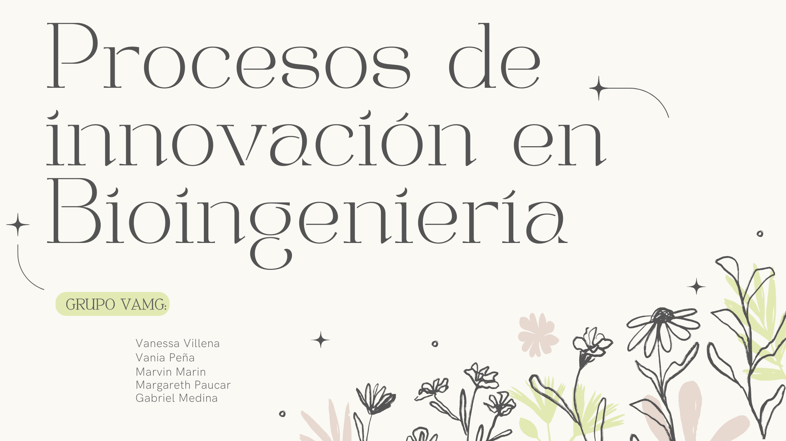

# GRUPO VAMG

# 📑 TABLA DE CONTENIDO
---
- [Descripción del grupo](#-descripción-del-grupo)
- [Integrantes del grupo](#-integrantes-del-grupo)
- [Descripción de integrantes del grupo](#-descripción-de-integrantes-del-grupo)
- [Lenguaje de programación](#lenguaje-de-programación)

# 🚀 DESCRIPCIÓN DEL GRUPO
---

# **👥 INTEGRANTES DEL GRUPO**
---

# 📝 DESCRIPCIÓN DE INTEGRANTES DEL GRUPO
---
**1) Gabriel Miguelangel Medina Pinedo**

**EDAD:** 18 años

**PASATIEMPO:** Leer novelas psicológicas y poemas, además del deporte.

**ROL:** Redactor de contenido:

\- Encargado de redactar y compilar la información de los integrantes.

**2) Vanessa Abigail Villena Camero**

**EDAD:** 17 años

**PASATIEMPO:** Interesada en la investigación, el aprendizaje continuo y las artes, como la danza, la escritura, el canto y la pintura.

**ROL:** Coordinación de equipo y apoyo general:

\- Encargada de apoyar a los integrantes en tareas específicas según necesidad.

\- Encargada de elaborar la carátula y materiales gráficos del proyecto.

**3) Margareth Kiara Paucar Fernandez**

**EDAD:** 17 años

**PASATIEMPO:** Correr, dibujar, leer y ver películas.

**ROL:** Apoyo general y revisión:

\- Colabora en la revisión de entregables para detectar errores o inconsistencias.

**4) Vania Zaleth Peña Lostaunau**

**EDAD:** 17 años

**PASATIEMPO:** Leer, escuchar música y tocar instrumentos.

**ROL:** Coordinación general y gestión de repositorio:

\- Asegurar la correcta integración y actualización del código.

\- Organizar y mantener el repositorio.

**5) Marvin Josue Marin Sucapuca**

**EDAD:** 18 años

**PASATIEMPO:** Jugar basket, tocar el ukelele, correr y ver series.

**ROL:** Apoyo en organización y logística del proyecto:

\- Colaboró en la planificación general del trabajo en equipo.
